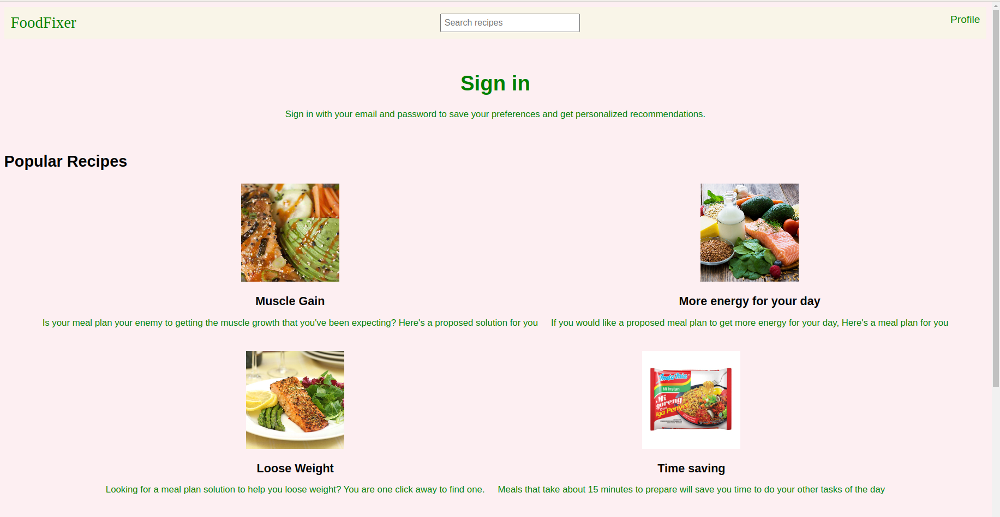
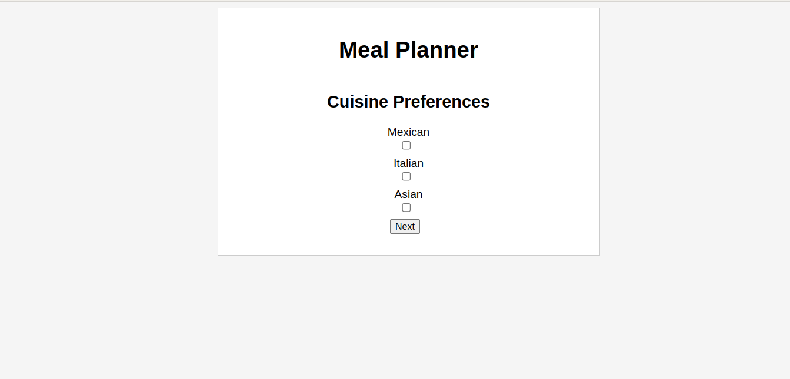

# Meal Planner Website

The Meal Planner Website is a web application that helps users generate a personalized meal plan based on their cuisine preferences, dietary restrictions, and desired outcomes. It provides a convenient way to plan weekly meals while taking into account individual preferences and goals.


## Features

- Select cuisine preferences: Choose from Mexican, Italian, and Asian cuisines.
- Specify dietary restrictions: Select dietary preferences such as gluten-free, lactose-free, and vegan options.
- Set desired outcomes: Define goals like losing weight, gaining muscle, eating healthier, having more energy, or saving time.
- Generate personalized meal plan: Based on the selected preferences, the website generates a customized weekly meal plan.
- Display meal plan: The generated meal plan is displayed in a table format, showing breakfast, lunch, and dinner for each day of the week.

## Installation and Usage

1. Clone the repository:

   ```bash
   git clone https://github.com/your-username/meal-planner-website.git
2. Navigate to the project directory:

    ````bash
    cd foodfixer-project    

3. Start a local server to host the website:

    ```bash
    python3 -m http.server
4. Open a web browser and visit http://0.0.0.0:8000/ to access the Meal Planner Website.

5. Click on the image of the Add New and fill out the preferences forms on the website:
    * Select your preferred cuisines.
    * Choose any dietary restrictions you have.
    * Specify your desired outcomes.

6. Click the "Next" button to proceed to the next form.

7. After completing all three preference forms, click the "Generate Meal Plan" button.

8. The website will generate a personalized meal plan based on your preferences.

9. The generated meal plan will be displayed in a table format, showing the meals for each day of the week.

## Files
The repository contains the following files and directories:

- `generate.css`: CSS file for styling the generated meal plan page.
- `index.html`: Main HTML file for the Meal Planner Website.
- `meal-planner.css`: CSS file for styling the meal planner forms.
- `README.md`: This README file providing information about the project.
- `script.js`: JavaScript file for handling form submissions and generating meal plans.
- `form1.html`: HTML file containing all three forms for selecting preferences.
- `generate.html`: HTML file for displaying the generated meal plan.
- `meal.json`: JSON file containing the meal data.
- `meal-planner.js`: JavaScript file for handling form submissions and generating meal plans.
- `profile.html`: HTML file for the user profile page.
- `resources/`: Directory containing additional resources such as images, fonts, or other media files.
- `style.css`: CSS file for styling the website layout and components.

## Screenshots
### Home Page


### Preferences Form


### Generated Meal Plan


## Contributing
Contributions are welcome! If you have any ideas or improvements for the Meal Planner Website, please feel free to contribute. Just fork the repository, make your changes, and submit a pull request.

## License
This project is licensed under the MIT License.